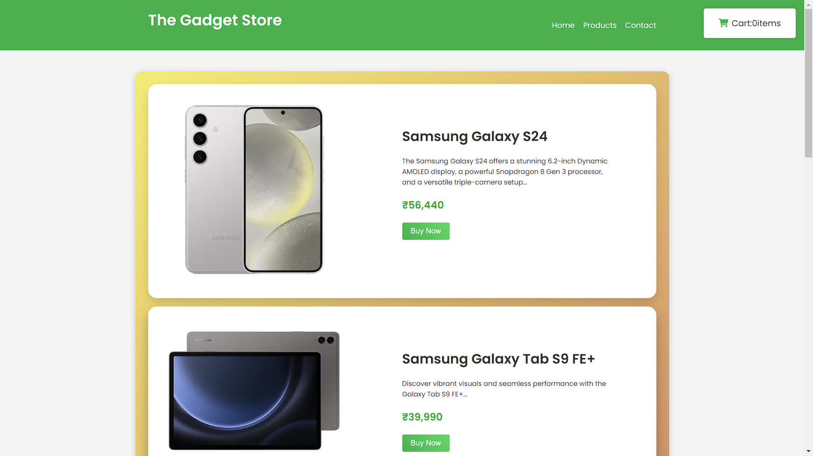

# E-Commerce Product Page

This is a simple, dummy E-commerce Product Page built with HTML, CSS, and JavaScript. It displays a collection of products with an interactive "Add to Cart" feature and a fixed cart icon that shows the total number of items added to the cart. This page is designed to demonstrate basic front-end web development concepts.

## Features

- **Responsive Design**: The page layout is responsive and adjusts to various screen sizes for a better user experience.
- **Product Listing**: Displays a variety of products, each with an image, description, and price.
- **Add to Cart Functionality**: Users can add products to the cart by clicking the "Buy Now" button, and the cart icon will update with the item count.
- **Hover Effects**: Product images and buttons include hover animations for improved interactivity.
- **Custom Styling**: Built with CSS, using the Google Fonts API for typography and Font Awesome for icons.


## Technologies Used

- **HTML**: For creating the page structure.
- **CSS**: For styling the page, including flexbox for layout and media queries for responsiveness.
- **JavaScript**: For adding functionality like the add-to-cart animation.
- **Google Fonts**: For the 'Poppins' font.
- **Font Awesome**: For the cart icon.

## Demo


## Installation

1. Clone the repository:
   ```bash
   git clone https://github.com/Pradyut-Guchhait/E-Commerce-Product-Page.git

